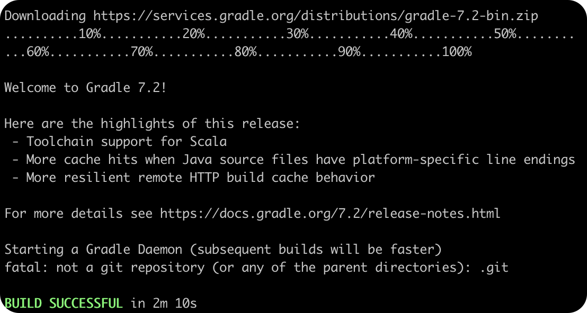

# Spring 源码学习

## 环境介绍
- jdk 1.8.0_152
- spring 版本 spring-framework-5.2.5.RELEASE
- 开发工具 Idea
- gradle 版本6.6.1
- 个人电脑 macbook

## 编译
在spring-framework目录下执行

`./gradlew :spring-oxm:compileTestJava`

结果：

